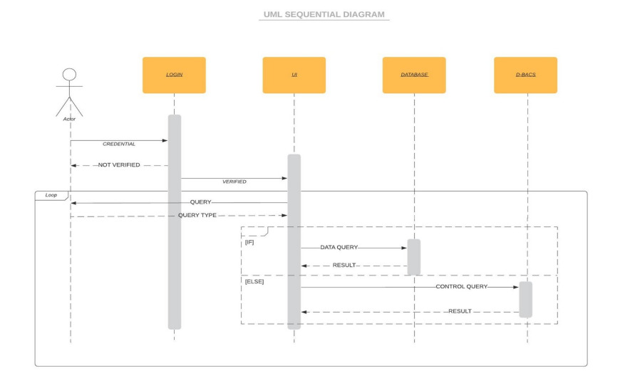
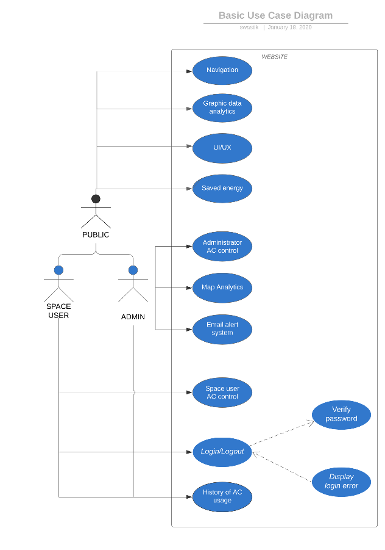
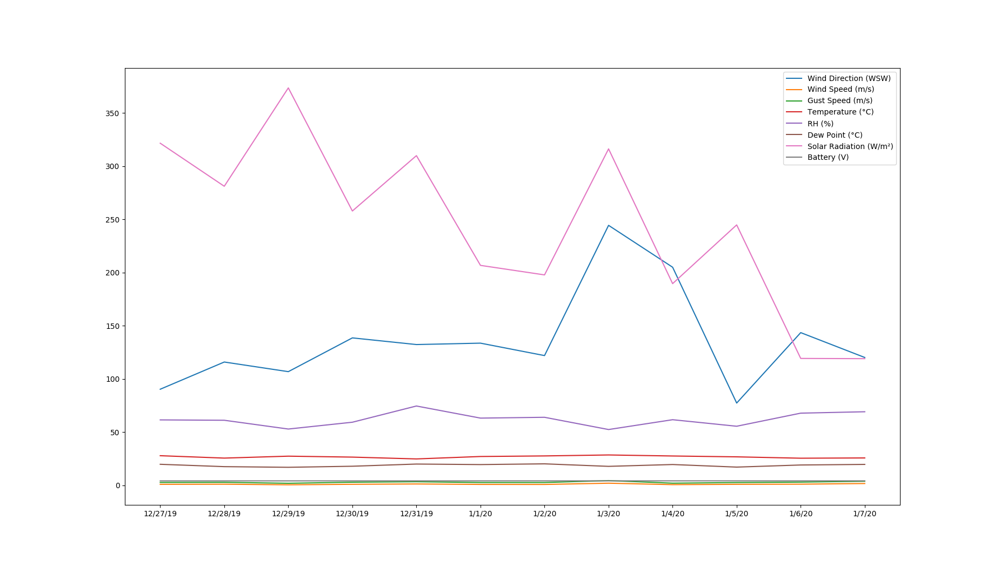
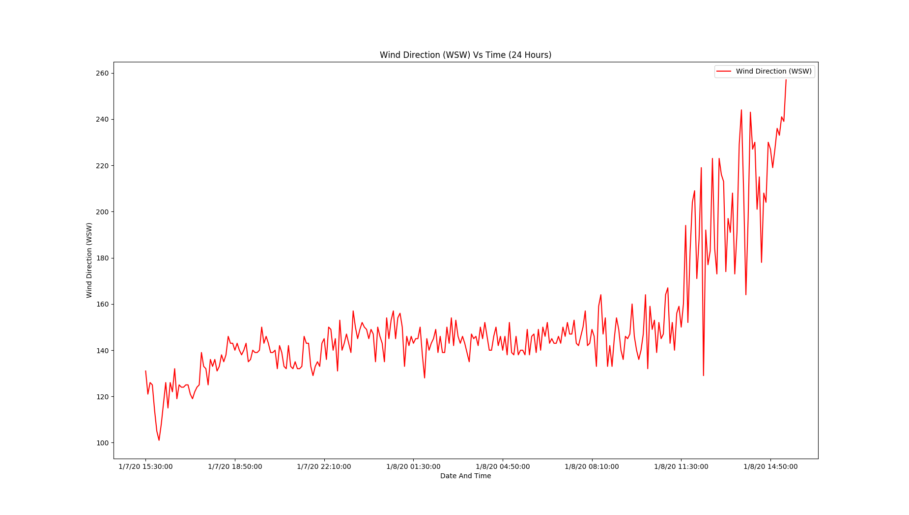
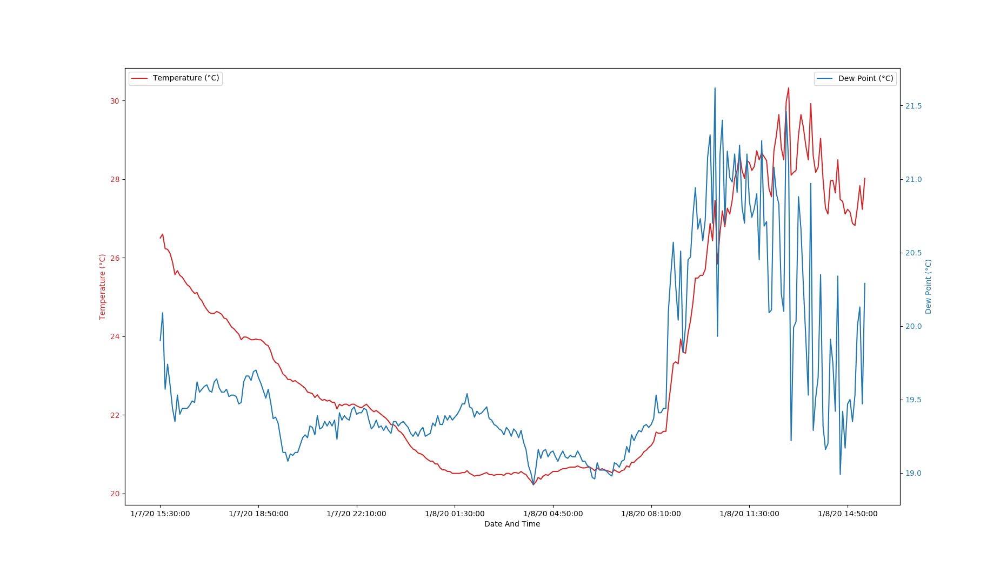

# Energy-Monitoring-And-Control
A user application to monitor and control the AC usage in Kohli Research Block, International Institute Of Information Technology, Hyderabad

## Problem Statement

Energy conservation is the effort made to reduce the consumption of energy.  This can be achieved either by using electronic devices more efficiently or by reducing the amount of time the device is used for. We aim to enable the average user to do both using our web application.

## Project Goal

To monitor and control air conditioning system in Kohli Research Block via a user friendly website integrated with an alarm system to save energy.

## Sprint One 

### Feasibility Study

+ Analysed the work based on the duration of the project

    This project extends for a total of 4 months. The team analysed how much work can be reasonably completed within this given time.

+ Understood the three types of end users of the product

    The project must satisfy the needs of three different types of users with different use cases.

+ Analysed the technical knowledge within the team

    We conducted a team meet to analyse how much technical knowledge is present with each team member, in order to take up and divide work accordingly.

### Requirements Analysis

+ Learnt to ask the right kind of questions and then listen carefully to the answers. Had three meetings with client to analyse all the components of the project in depth.

+ Consolidated requirements, rationalized them, caught overlaps and gaps
Created UML use case diagram, UML class diagrams and Sequential diagrams

+ Formally documented the requirements with the help of three documents: 
SRS, Design Document, Design Plan

+ Submitted the SRS and design documents to the client and received approval!

###  Technical Stack

+ Material UI: Frontend design
    React components for faster and easier web development.

+ React: Front-End Framework
    React is a JavaScript library that is used for building user interfaces. 

+ Express: Back-End Framework
    Express helps in designing great web applications and APIs. Express supports many middlewares which makes the code shorter and easier to write.

+ Node.js: JS Runtime Environment
    Node.js provides a JavaScript Environment which allows the user to run their code on the server

+ MongoDB: Cross-platform Document-Oriented Database
    MongoDB is a NoSQL database where each record is a document comprising of key-value pairs that are similar to JSON objects.

### Design template

+ 90% of our assessment of a product is made on color alone.

+ Color should be considered with care for every design decision, particularly on websites.

+ Chose a sharp and modern palette that uses different tones of orange and blue to create a playful, energetic color palette.

+ Kept in mind that the target audience consists of sophisticated users who want to see pleasant colours on their screens.







## Sprint Two

### Learning BACnet

We faced many challenges in this part of the sprint such as:

+ Scarcity Of Resources
    The lack of documentation on the BACnet protocol for HVAC (Heating Ventilation And Air Conditioning) systems was a setback.

    We used recently published paper on BACnet and contacted the researcher for queries.

+ BACO vs pybacnet
    pybacnet is the library used for interface with the Daikin system, in Python2 and BACO is in Python3. 

    We began coding in Python3 using BACO but later switched to pybacnet due to more extensive documentation.

+ Location of Daikin System
    Implementation, setup and coding of the backend required the team to move to the 4th floor DSAC lab of KCIS each time, which was quite cumbersome.

### Thesis Analysis
+ Analysed the floor plans and identified the location of the Daikin-DBACS system that can be used to procure information about every running AC in the building.

+ Learnt how to up base on the 4th floor of KCIS via LAN connection

+ Analysed the type of data that we are expected to obtain and its format.

+ Understood the BACnet protocol and its uses in depth.

### Database And Daikin D-BACS device

+ The data obtained from the database is  stored on the cloud in raw JSON format.
+ MongoDB is a NoSQL database where each record is a document comprising of key-value pairs that are similar to JSON objects. 
+ Once MongoDB is installed, users can make use of Mongo shell as well. Mongo shell provides a JavaScript interface through which the users can interact and carry out operations
+ There are 77 AC units each with 28 properties.

### Connection

+ We used the LAN network on the fourth floor to establish a connection with the device.

+ The team uses SSH to enable secure system administration and file transfers over insecure networks.

### Learning the Technical Stack

+ Having only worked with SQL and Flask previously, the presented technical stack required all the team members to spend time learning how to code using REACT, Node.js, Express and MongoDB.

+ We learnt important web development concepts such as: 

    + JWT Authentication
    + Error handling cases
    + Database design
    + Effective version control
    + Reusing code and other assets


## Sprint Three

> Python scripts to collect data
+ Real - time data is obtained by running the script at the required time instance. The script is kept running on the personal computer located in DSAC, KCIS 4th floor.

+ All 28 properties of 77 ACs in the building are read by the script. The script collects AC data every 10 minutes for storage. The properties are stored in the MongoDB database.


> Python scripts to control AC

+ The AC is selected by passing a parameter to the script that identifies one out of the 77 ACs

+ The selected AC can be switched ON or OFF by setting the status property to 1 or 0 respectively.

## Sprint Four

Integration of a the backend APis with frontend display. This included:
+ View Temperature
  
+ Select Air Conditioning Unit Through Interactive Map
  
+ Set status via dropdown
  
+ Adjust temperature using a sliding bar
  
+ Secure Login/Registration

## Sprint Five

+ HOBOlink is a web-enabled software platform that makes it easy to view and to manage your data remotely.

+ Designed for HOBO RX3000 Remote Monitoring Systems, the data logger software allows you to easily access current and historical data.

+ HOBOlink APIs written in Python3 are used to fetch data from the monitoring device on the KRB rooftop.

+ Three graphing scripts were written to represent the data
  









## Dashboard Selction And Integration

+ A REACT and Material UI dashboard to suit our needs was chosen.

+ The following choice was made after discussion with the client: [Link](https://material-ui.com/store/previews/devias-kit/)
  
+ All the APIs and script written were now integrated with the new chosen interface.

+ The login and logout screen was refined to change according to the user selection of his/her role.
  
## Sprint Six

## AC Mapping for entire KRB 

For this task, we moved from room to room identifying AC numbers corresponding to the room names and floor numbers and created a spreadsheet mapping of the same.

This was very hard as there were Acs that weren't functional and not all rooms in KCIS are accessible!

## AC Control Request Notifications

The admin dashboard receives notifications from the space user dashboard when the space user makes a request.
This feature is implemented using node packages.

## Sprint Seven

The admin dashboard has the additional functionality of being able to send email alerts to the users based on over usage. This is done via a button click trigger. The email functionality is implemented using the NodeJS nodemailer package.

Social media authentication via Gmail was added to the login page and the 

The client asked for extensive documentation which can help the unaware user to set up and the run the application on his or her system. This was completed and submitted in the seventh sprint.

## Sprint Eight

The testing mostly involved manual checking. That is, running a python script and checking whether the desired output has been obtained. 

For example, the script  created to check the state of the AC. Here, we can switch the AC off through the app, and verify that the AC is actually off by getting the state of the AC through the script.

Testing on software level to check if the server is working or not, and api are
being properly served.
Testing on hardware level to check if AC is responding to the given input through
BACnet protocols.

HOBOlink data graphs were tested by looking at the KRB HOBOlink website and comparing the data values plotted in the graphs using python scripts.

## The End Product

These instructions will get you a copy of the project up and running on your local machine. You will be able to access, based on your permissions alloted to you, the following features:
| | |
| --- | --- |
|HOBOlink graphs | All Users |
| AC Control | Administrator, Space User |
| Request For AC Control | Space User |
| View Temperature | Space User, Administrator |
| Email Alert | Administrator |

It is recommended that the following two commands are run before installation on Linux:
```
sudo apt-get update -y
sudo apt-get upgrade -y
```
## Virtual Environment
A virtual environment is a tool that helps to keep dependencies required by different projects separate by creating isolated python virtual environments for them. Virtual Environment should be used whenever you work on any Python based project.
And in order to create your virtual environment follow these steps:
```
    pip install virtualenv
    virtualenv <Name Of Environment>
    source <Name Of Environment>/bin/activate
```
Then continue with the following steps to setup and run the application.
A referance can be found [here](https://www.geeksforgeeks.org/python-virtual-environment/)

## System Requirements

###  Git

For Linux: 
```bash
sudo apt-get install git -y
# Configure the username, replace First Last:
git config --global user.name "First Last"
# Configure the email, replace example@example.com:
git config --global user.email "example@example.com"
```
[Intstall and configure git](https://www.linode.com/docs/development/version-control/how-to-install-git-and-clone-a-github-repository/).

###  Node

For Linux: 
```bash
curl -sL https://deb.nodesource.com/setup_13.x | sudo -E bash -
sudo apt-get install -y nodejs
```
The `nodejs` package has both the `node` and `npm` binaries.

> How to run npm Behind A Proxy Server

Once you have obtained the proxy settings (server URL, port, username and password); you need to configure your npm configurations as follows.
```
    npm config set proxy http://<username>:<password>@<proxy-server-url>:<port>
    npm config set https-proxy http://<username>:<password>@<proxy-server-url>:<port>
```
Proxy can be deleted by running the following commands.
```
    npm config delete proxy
    npm config delete https-proxy
```
A detailed referance can be found [here](https://www.freecodecamp.org/forum/t/how-to-run-npm-behind-a-proxy-server-a-step-by-step-guide/19386)

###  MongoDB

Install the community edition [here](https://docs.mongodb.com/manual/installation/#mongodb-community-edition-installation-tutorials).

For Ubuntu 16.04 (Xenial) Linux distribution:
```
    wget -qO - https://www.mongodb.org/static/pgp/server-4.2.asc | sudo apt-key add -
    sudo apt-get install gnupg
    echo "deb [ arch=amd64,arm64 ] https://repo.mongodb.org/apt/ubuntu xenial/mongodb-org/4.2 multiverse" | sudo tee /etc/apt/sources.list.d/mongodb-org-4.2.list
```
Issue the following command to reload the local package database and install the latest stable version.
```
    sudo apt-get update
    sudo apt-get install -y mongodb-org
```

The following system requirements are for the **BACnet** backend componant:

###  Python `(2.7.17)`

This is the latest Python 2 release and can be installed along with its `pip` on Linux:
```
    sudo apt install python2.7 python-pip
```

###  Swig

Swig is a compiler that makes it easy to integrate C code with python.

On Linux:
```
    sudo apt-get install -y swig
```

###  sMAP `(2.0)`

Protocol which easily and quickly exposes and publishes time-series data from a wide variety of sensors simply and flexibly.

On Linux:
```
    pip install smap
```

The following system requirements are for the **HOBOlink** backend componant:

### Python`(3.X)`

On Linux:
```
sudo apt-get install python3 python3-pip
```
## Setup

To set up the **BACnet** backend componant follow the following steps:

###  Library Packages

Install the following libraries using the command given:
```
    sudo apt-get install build-essential autoconf libtool pkg-config python-opengl python-imaging python-pyrex python-pyside.qtopengl idle-python2.7 qt4-dev-tools qt4-designer libqtgui4 libqtcore4 libqt4-xml libqt4-test libqt4-script libqt4-network libqt4-dbus python-qt4 python-qt4-gl libgle3 python-dev
```

Now, follow the following steps to set up the BACnet paths:
```
    cd dass05/src/BACNET/libraries
    sudo cp -r lib32 /
    sudo cp -r libx32 /
```

To troubleshoot any error refer to this [link](https://stackoverflow.com/questions/26053982/setup-script-exited-with-error-command-x86-64-linux-gnu-gcc-failed-with-exit?page=1&tab=votes&fbclid=IwAR1rsxEByUDfidMkHuE6i6C39aKn7s6Ai_qOITq8LIxJdggj8Eaiatk8sNI#tab-top).

To test if the BACnet scripts can now be run on your system follow the following steps.

```
cd dass05/BACnet/pybacnet/tools
python bacnet-scan.py
```
If there are no errors , it means pybacnet and all the dependancies required for BACnet communication have been installed correctly.

To setup the backend **HOBOlink** componant the following steps must be followed:

### Libraries 

Install the following libraries using the `pip` command:

```
pip3 install beautifulsoup4
pip install pandas
pip3 install requests
pip3 install urllib
pip3 install statistics 
pip3 install matplotlib
```

## Running the application

1. git clone [this](https://gitlab.com/dass-2020/dass05) repository
2. cd dass05/src

### Running  the Mongo daemon

1. Open the terminal
2. Run:
   ``` 
        sudo mongod
    ```
Mongo will now be running on port `27017`

### Running Express

Open a new terminal window `(Ctrl + Shift + T)` and run the following commands
```   
   cd  react-material-backend
   npm install
   npm start
```

### Running React

Open a new terminal window `(Ctrl + Shift + T)` and run the following commands
```
    cd  react-material-frontend
    npm install
    npm start
```
   
Navigate to localhost:3000/ in your browser to view and use the application!

The table of AC unit mapping categorised by floors can be found [here](https://docs.google.com/spreadsheets/d/10AdjG84STh8zIIMlpu9XHGkiaz8o0GtFspJXN-ukKtU/edit?usp=sharing).
There are 77 ACs in the table.
4 ACs under Third Floor, Wing 3 are yet to be mapped. These are AC numbers 74, 75, 76, 77.
The AC numbered 27 in Second floor, Wing 2 is not functional.

## Important Scripts
### BACnet
These scripts can be found at:
```
    cd dass05/src/BACnet
```

* `bacnet-scan.py`: Get the current data of all ACs, thats 28 properties each of 77 ACs.
* `changetemp.py`: Change temperature of an AC. 
    <br> Run as: 
    ```bash
        python changetemp.py <AC Number> <Desired Temperature>
    ```
* `checkstatus.py`: Check status of an AC. 
  <br> Run as:
    ```bash
        python checkstatus.py <AC Number>
    ```
* `checktemp.py`: Check temperature of an AC. 
  <br> Run as:
    ```    
        python checktemp.py <AC Number>
    ```
* `logdata.py`: 
  It logs ACs data when connected to a local mongodb database that is currently set up on the local system at KRB. Data every 10 mins using cronjob syscall and stored it locally.

* `off.py`: Switch off an AC. 
  <br> Run as:
    ```
        python off.py <AC Number>
    ```

* `on.py`: Switch on an AC. 
  <br> Run as:
    ```
        python on.py <AC Number> 
    ```

### HOBOlink
These scripts plot data extracted from the Hobolink cloud can be found at:
```
    cd dass05/src/HOBOlink
```

* `daily_HOBOlink.py`: Plots graphs for each of 8 properties using data of the last 24 hours. 
  
* `properties_HOBOlink.py`: Plots one graph for the past month data of all 8 properties.
  
* `versus_HOBOlink.py`: Plots graphs of a combination of two properties using past 24 hours data.
  
## Features

The user can register and login as a space user which means he or she has access rights to his/her floor only.

The user can register and login as a administrator which means he or she has access rights to all floors only.

### Social Media Authentication

Athentication via google accounts can be done to log into the dashboard.
### HOBOlink graphs

HOBOlink is a web-enabled software platform designed for HOBO RX3000/MicroRX Remote Monitoring Systems and HOBOnet Field Monitoring Systems. Our application retrieves data from the Remote Monitoring System on the roof of the KRB building on campus and plots the past 24 hour data of the 8 available properties:
* Wind Direction    
* RH
* Wind Speed        
* Dew Point
* Temperature       
* Solar Radiation
* Battery           
* Gust Speed

### AC Control

The Admistrator can control the AC of a particular floor as seen below. 

### Request for AC Control

The space user can place a request to control the AC of a particular floor/wing as seen below.

These request are either granted permission or dismissed by the administrator.

### Email Alert

The administrator can send an email alert to the users in the event of overuse/misuse. The email is triggered by a button click.

## Authors 

Swastik Murawat 2018101022<br>
Jyoti Sunkara 2018101044<br>
Fanish Jain 2018101021<br>
Sartak Periwal 2018101024<br>
Pranav Tadimeti 2018101055<br>
